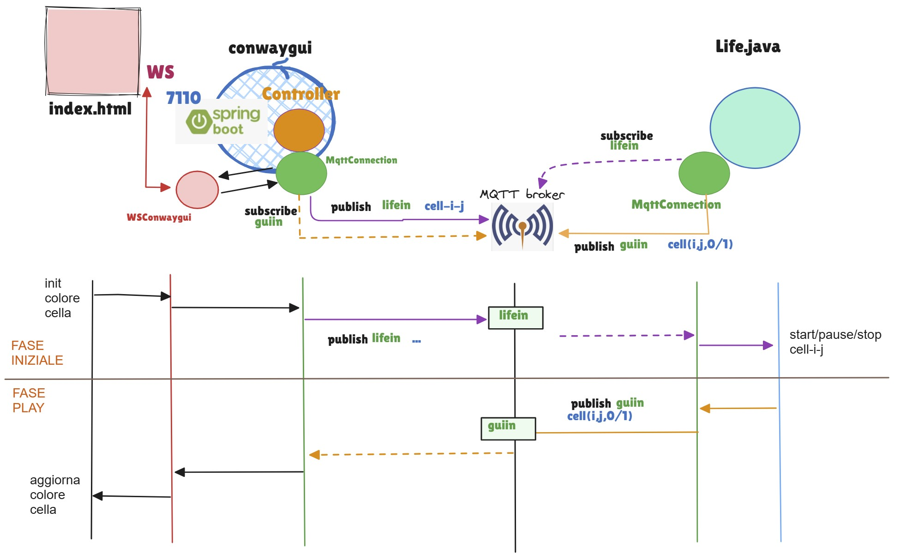

.. role:: red
.. role:: blue
.. role:: silde2
.. role:: red 
.. role:: blue 
.. role:: brown 
.. role:: remark
.. role:: worktodo
.. role:: slide
.. role:: slide1
.. role:: slide2
.. role:: slide3
.. role:: slidekp
.. role:: worktodo 

 

.. _LifeCore: file:///C:/Didattica2025/mcrsv24/conwaygui/src/main/java/unibo/disi/conwaygui/app/LifeCore.java
.. _LifeControl: file:///C:/Didattica2025/mcrsv24/conwaygui/src/main/java/unibo/disi/conwaygui/app/LifeControl.java
.. _OutInMqtt: file:///C:/Didattica2025/mcrsv24/conwaygui/src/main/java/unibo/disi/conwaygui/app/OutInMqtt.java

.. _WSConwaygui: file:///C:/Didattica2025/mcrsv24/conwaygui/src/main/java/unibo/disi/conwaygui/ws/WSConwaygui.java
.. _life.qak: file:///C:/Didattica2025/mcrsv24/conwayqak/src/life.qak
.. _LifeCoreAgain: file:///C:/Didattica2025/mcrsv24/conwayqak/src/main/java/LifeCoreAgain.java
 
.. _OutInMqttForactor: file:///C:/Didattica2025/mcrsv24/conwayqak/src/main/java/OutInMqttForactor.java

===================================
ConwayLife25
===================================

---------------------------------------
Requisiti ConwayLife25
---------------------------------------

:slide3:`Goal`: 
Progettare e costruire un :blue:`sistema software` che realizza il gioco della vita di Conway.

-----------------------------------------
Progetto conwaygui
-----------------------------------------

.. list-table::
    :widths: 15,35,50
    :width: 100%
    
    * - **Componente**
      - **Ruolo e Tipo**    
      - **Note**
    * - `LifeCore`_
      - Logica del game in Java   
      - Ha un riferimento a *OutInMqtt* per fare il display delle celle.
        Le sue operazioni sono invocate da :slidekp:`LifeControl`
    * - `LifeControl`_
      - Controllo del game in Java   
      - Riceve comandi (``start/stop/exit``)  dalla GUI  mediante *OutInMqtt* e usa *LifeCore*.
    * - `OutInMqtt`_
      - Dispositivo di I/O in Java   
      - Interagisce con le pagine HTML vie MQTT usando ``MqttConnection25`` perchè l'uso di una *receiveMsg* bloccante
        è accettabile.

        In alternativa potrebbe usare *MqttConnectionBase* ( e *MqttConnCallback*)
    * - `WSConwaygui`_
      - Gestione in Java di informazioni da/a pagina HTML    
      - Estende  *AbstractWebSocketHandler*  di *org.springframework.web.socket.handler*.
        Usa ``MqttConnection25`` per inviare comandi a *LifeControl* e per fare update delle pagine
        (metodo *broadcastToWebSocket*)
        cone le informazioni ricevute da *LifeControl*.  
        

-----------------------------------------
ConwayLife25 gui
-----------------------------------------
 

.. list-table::
    :widths: 60,40
    :width: 100%
    
    * - 
        .. image::  ./_static/img/conway/conwaygui.jpg
           :align: center 
           :width: 50%  
      - **xxx**    

 
-----------------------------------------
Progetto conwayqak
-----------------------------------------

Il componente `LifeControl`_ è riscritto come actor-qak e il sistema è stato esteso con un componente `OutInMqttForactor`_
che trasforma i messaggi ricevuti via MQTT in **dispatch** per l'actor `lifecontrol` definito in `life.qak`_.

.. image::  ./_static/img/conway/conwayqakarch.jpg
  :align: center 
  :width: 100%   

.. list-table::
    :widths: 15,35,50
    :width: 100%
    
    * - **Componente**
      - **Ruolo e Tipo**    
      - **Note**
    * - `LifeCoreAgain`_
      - Logica del game in Java.  
      - E' lo stesso codice di `LifeCore`_. Ha un riferimento a *OutInMqtt* per fare il display delle celle.
        Le sue operazioni sono invocate dall':slidekp:`actor lifecontrol` definito in `life.qak`_.
    * - `life.qak`_
      - Logica del controllo del game **in qak**. 
      - Gestisce messaggi (dispatch) inviati da   `OutInMqtt`_.
    * - `OutInMqttForactor`_
      - Dispositivo di I/O in Java
      - Interagisce con le pagine HTML vie MQTT usando *MqttConnection25*.
        Diversamente da `OutInMqtt`_, alla ricezione di un messaggio, invia un dispatch al suo 'owner'
        cioè all'**actor lifecontrol**
         
Il refactoring del controllo come actor agevola la gestione di eventi e messaggi aggiuntivi che potrebbero
essere generati da altri componenti.

.. image::  ./_static/img/conway/conwayqakarchPlus.jpg
  :align: center 
  :width: 100%   
 

-----------------------------------------
Progetto conwayactorsqak
-----------------------------------------

.. image::  ./_static/img/conway/conwactorsqak.jpg
  :align: center 
  :width: 100%  

 

